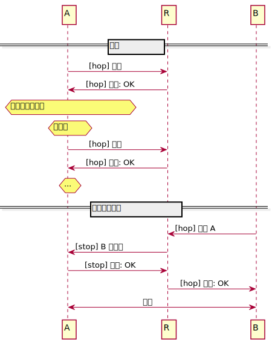

# 回路中继 V2

> 这是对官方 [`Circuit Relay protocol V2`](https://github.com/libp2p/specs/blob/master/relay/circuit-v2.md) 规范的翻译

这是 libp2p 回路中继协议的版本2。

| 生命周期阶段 | 完成度 | 状态 | 最新修订 |
| --- | --- | --- | --- |
| 3A  | 推荐 | 积极 | r1, 2021-12-17 |

作者：@vyzo

兴趣小组: [@mxinden], [@stebalien], [@raulk]

[@vyzo]: https://github.com/vyzo
[@mxinden]: https://github.com/mxinden
[@stebalien]: https://github.com/stebalien
[@raulk]: https://github.com/raulk

有关完成度级别和规范状态的内容，请参阅[生命周期文档](https://github.com/libp2p/specs/blob/master/00-framework-01-spec-lifecycle.md)

## 目录
- [介绍](#介绍)
    - [基本原理](#基本原理)
- [协议内容](#协议内容)
    - [连接交互](#连接交互)
    - [`Hop`跃点协议](#`Hop`跃点协议)
        - [预留](#预留)
        - [连接启动](#连接启动)
    - [`Stop`终止协议](#`Stop`终止协议)
    - [预留凭证](#预留凭证)
- [Protobuf](#protobuf)

## 介绍
这是 libp2p-circuit 中继协议的第2版规范内容。

与第1版相比，有一些重要的不同之处：
* 该协议已分为两个子协议，`hop` 和 `stop`
    * `hop` 协议由客户端发起，在客户端向中继发送命令时使用；它用于在中继中保留资源并通过中继打开到度等点的交换连接。
    * `stop` 协议管理回路交换连接的端点
* 引入了资源预留的概念，希望使用中继的对等方明确预留资源并获得 *预留凭证*，这些预留凭证可以分发给它们的对等点用于路由。
* 引入了有限中继的概念，由此中继提供具有时限持续时间和数据上限的交换连接。

### 基本原理
协议向第2版演进是受到我们在实际场景中使用中继的体验的影响。原始协议非常灵活，但在中继连接的实用性方面存在一些局限性。

主要问题是第1版没有在中继中保留资源的机制，这导致中继不断超额订阅，并且需要（通常无效的）试探来平衡资源。在实践中，运行中继被证明是一项繁重的任务，需要具有大量硬件和带宽成本的专用主机。此外，通过中继直接连接升级的打洞协调工作正在进行中，不需要无限中继连接。

为了解决这种情况并无缝支持广泛打洞，我们引入了有限的中继和预定槽。这允许中继有效地管理其资源并提供小规模服务，从而能够部署中继大军以实现极端水平扩展，而无需过多的带宽成本和专用主机。

此外，在最初，将回路启动和终止合并在同一协议中，使得按需提供中继服务变得非常困难，与主机是否支持客户端功能脱钩。

为了解决这个问题，我们将协议拆分为 `hop` 和 `stop` 子协议。这使我们能够始终在主机中启用客户端功能，同时在通过 [AutoNAT](https://github.com/libp2p/specs/issues/180) 确定主机的可达性后，提供稍后在公共主机中安装中继服务的选项。

## 协议内容

### 连接交互
下图说明了在建立中继连接的过程中，三个对等点 *A*、*B* 和 *C* 之间的交互。节点A 是私有节点，不可公开访问；它利用对 等点R 的服务作为中继。对等B 是另一个希望通过 R 连接到 对等A 的对等点。



<details>
  <summary>图表重现说明</summary>

使用 [https://plantuml.com/](https://plantuml.com/) 和下面的内容来重现图表。

```
@startuml
skinparam backgroundColor white
participant A
participant R
participant B

skinparam sequenceMessageAlign center

== 预留 ==

A -> R: [hop] 预留
R -> A: [hop] 状态: OK

hnote over A: 预留即将到期。
hnote over A: 刷新。

A -> R: [hop] 预留
R -> A: [hop] 状态: OK

hnote over A: ...

== 回路建立连接 ==

B -> R: [hop] 连接 A
R -> A: [stop] B 的连接
A -> R: [stop] 状态: OK
R -> B: [hop] 状态: OK

B <-> A: 连接
@enduml
```

</details>

### `Hop`跃点协议
Hop 协议管理客户端和中继之间的交互；它使用协议 ID /libp2p/circuit/relay/0.2.0/hop。

协议分为两部分：
* 预留，由希望接收中继服务的对等点发起；
* 连接初始化，由希望通过中继连接某对等点的对等点发起。

#### 预留
为了创建一个预留，对等点打开一个和中继的连接，并以 `type = RESERVE` 发送一条 `HopMessage`:
```
HopMessage {
  type = RESERVE
}
```

中继以 `type = STATUS` 响应一条 `HopMessage`，用来指示预留是否被中继接受。

如果预留被接受，回送的消息符合一下格式：
```
HopMessage {
  type = STATUS
  status = OK
  reservation = Reservation {...}
  limit = Limit {...}
}
```

如果预留被拒绝，中继回送的 `HopMessage` 符合一下格式：
```
HopMessage {
  type = STATUS
  status = ...
}
```
其中 `status` 字段的值非 `OK`。常见的拒绝状态码有：
* `PERMISSION_DENIED` 由于使用 ACL 的对等过滤而被拒绝预留；
* `RESERVATION_REFUSED` 由于其它原因，如预留过多，而被拒绝预留。

`reservation` 字段提供有关预订本身的信息，该结构具有以下字段：
```
Reservation {
   expire = ...
   addrs = [...]
   voucher = ...
}
```
* `expire` 包含 UTC UNIX 过期时间。预留将在此时间后无效，客户端负责更新；
* `addrs` 包含所有公共中继的地址，包括中继节点的 peerID，但不包含尾部的 `p2p-circuit` 部分；客户端可以使用这个列表构建自己的 `p2p-circuit` 中继地址用来广播，通过封装 `p2p-circuit/p2p/QmPeer`，其中 `QmPeer` 是它自己的 peerID。
* `vocher` 是二进制形式的预留凭证，详细信息参阅 [预留凭证]

`HopMessage` 如果存在 `limit` 字段，则该字段提供中继在中继连接中应用的限制信息。如果不存在，则表示中继施加任何限制。该结构具有以下字段：
```
Limit {
  duration = ...
  data = ...
}
```
* `duration` 表示中继连接的最大持续时间（单位秒）；如果为 0，则没有限制；
* `data` 表示在每个方向上传输的最大字节数；如果为 0,则没有限制。

注意，只要存在从对等点到中继的活跃连接，预留 在到期之前一直有效。如果对等点断开连接，则 预留 不再有效。

在所有 预留 都过期后，中继服务器可能会根据其管理策略断开连接。期望服务器将尽最大努力在任何保留期间保持连接，并根据其连接管理策略对其进行标记以防止意外终止。但是，如果中继服务器过载，它仍可能会断开保留连接以维持其资源配额。

***注意： 协议实现不应该接受已中继的预留***

#### 连接启动
为了通过中继发起一个到对等点的连接，发起者打开一个连接，并发送以 `type = CONNECT` 的 `HopMessage`:
```
HopMessage {
  type = CONNECT
  peer = Peer {...}
}
```
其中 `peer` 字段是一个对等点结构，包含目标对等点的`ID` 和在主动中继情况下的对等点地址（可选）：
```
Peer {
  id = ...
  addrs = [...]
}
```
***注意：出于安全原因，主动中继功能被认为已弃用，至少在公共中继中是这样***

尽管如此，该协议仍保留该字段以支持在受控环境中实际需要使用主动中继功能的极少数情况下的功能。

如果中继有来自对等点的预留（因此是活跃连接），则它使用 `stop` 协议打开连接的第二跳；细节与协议无关，`hop` 唯一重要的是它是否成功打开中继连接。如果中继连接成功建立，则中继回送以 `type = STATUS` 和 `status = OK` 的 `HopMessage` ：
```
HopMessage {
  type = STATUS
  status = OK
  limit = Limit {...}
}
```
此时原始 `hop` 流成为中继连接。该字段（如果存在）通过上述 `limit` 语义向发起者传达应用与中继连接的限制。

如果无法建立中继连接，则中继回送以 `type = STATUS` 和 非`Ok` 的 `status` 的 `HopMessage`。常见的故障状态码有：
* `PERMISSION_DENIED` 连接由于 ACL 的对等过滤而被拒绝；
* `NO_RESERVATION` 目标对等点没有活跃保留；
* `RESOURCE_LIMIT_EXCEEDED` 发起者或目标对等点的中继连接过多；
* `CONNECTION_FAILED` 中继无法值终止与目标对等点的连接。

***注意：协议实现不应该接受已中继连接的连接启动***

### `Stop`终止协议
Stop 协议管理中继和目标对等点之间的连接终止；使用协议 ID `/libp2p/circuit/relay/0.2.0/stop`。

为了终止中继连接，中继使用到目标对等点的现有连接打开流。如果不存在现有连接，主动中继可能会尝试是使用发起者提供的地址打开一个连接，但正如上一节所述，此功能通常被弃用。

中继发送带有 `type = CONNECT` 的 `StopMessage`，形式如下：
```
StopMessage {
  type = CONNECT
  peer = Peer { ID = ...}
  limit = Limit { ...}
}
```
* `peer` 包含一个有发起者 `ID` 的 `Peer` 结构体；
* `limit` 如果有，则具有上一节所述的限制。

如果目标对等点接受（终止）连接，则以 `type = STATUS` 和 `status = OK` 的 `StopMessage` 回送给中继：
```
StopMessage {
  type = STATUS
  status = OK
}
```
此时原始 `stop` 流成为中继连接。

如果目标由于某种原因未能接受终止连接，则它会以 `type = STATUS` 和非 `Ok` 的 `status` 回送给中继。常见的状态码有：
* `CONNECTION_FAILED` 由于某种原因在内部无法创建中继连接。

### 预留凭证
有效预留应具有 *预留凭证*（Reservation Vouchers）。这些是由中继签名的加密证书，证明它愿意为对等点提供预留服务。目的是最终要求使用预留凭证对中继进行拨号，但目前无强制要求，因此凭证仅供参考。

凭证本身是一个[签名信封](https://github.com/libp2p/specs/blob/master/RFC/0002-signed-envelopes.md)。信封域是 `libp2p-relay-rsvp` 并且使用 multicodec 编码 `0x0302`。

信封具有以下有效内容，采用 protobuf 格式：
```
message Voucher {
  required bytes relay = 1;
  required bytes peer = 2;
  required uint64 expiration = 3;
}
```
* `relay` 是中继的 peerID；
* `peer` 是预留点的 peerID；
* `expiration` 是预留的 UNIX UTC 到期时间。

所有内容是规定好的，其中消息的元素按字段 ID 顺序写入，没有未知字段。

## Protobuf

```protobuf
message HopMessage {
  enum Type {
    RESERVE = 0;
    CONNECT = 1;
    STATUS = 2;
  }
  required Type type = 1;
  optional Peer peer = 2;
  optional Reservation reservation = 3;
  optional Limit limit = 4;
  optional Status status = 5;
}
message StopMessage {
  enum Type {
    CONNECT = 0;
    STATUS = 1;
  }
  required Type type = 1;
  optional Peer peer = 2;
  optional Limit limit = 3;
  optional Status status = 4;
}
message Peer {
  required bytes id = 1;
  repeated bytes addrs = 2;
}
message Reservation {
  required uint64 expire = 1; // Unix expiration time (UTC)
  repeated bytes addrs = 2;   // relay addrs for reserving peer
  optional bytes voucher = 3; // reservation voucher
}
message Limit {
  optional uint32 duration = 1; // seconds
  optional uint64 data = 2;     // bytes
}
enum Status {
  OK                      = 100;
  RESERVATION_REFUSED     = 200;
  RESOURCE_LIMIT_EXCEEDED = 201;
  PERMISSION_DENIED       = 202;
  CONNECTION_FAILED       = 203;
  NO_RESERVATION          = 204;
  MALFORMED_MESSAGE       = 400;
  UNEXPECTED_MESSAGE      = 401;
}
```